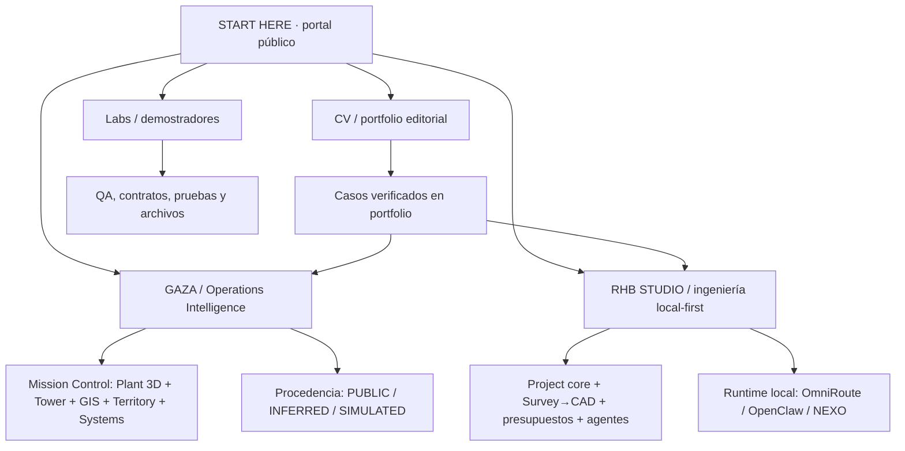
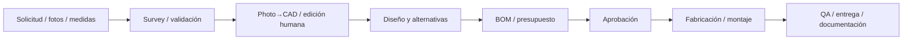

# Mapa maestro · Héctor Lobato / CV / GAZA / RHB STUDIO

**Versión:** 2026-10-07 · **Naturaleza:** catálogo de información y rutas, no certificado de producción ni de commissioning.

## Visión general

## 1. CV / portfolio

**Objetivo:** un currículum legible, completo, elegante y con profundidad técnica.

**Fuente de contenido:** el portfolio existente `index.html` y sus fichas `projects/*.html`. **No sustituir ni reducir datos profesionales acreditados** al rediseñar.

**Páginas / secciones previstas:**
1. Portada editorial (Atelier + jerarquía Swiss).
2. Perfil profesional y trayectoria. Revisar fechas, roles, empleadores y formación antes de publicar afirmaciones nuevas.
3. Competencias: integración AV/DSP, KNX/DALI, redes/IT-OT, CAD y fabricación, desarrollo web/GIS, automatización y agentes.
4. Archivo de proyectos: **Mar Salada, GAZA, RHB STUDIO, Casa NOAH, Las Dalias/Akasha, residencia tecnológica privada, XXXIA STUDIO**, con ficha fuente.
5. Storytelling por scroll: imágenes existentes de **cada proyecto**, planos y diagramas reales etiquetados. No sustituir fotografías pendientes por imágenes fotorrealistas ficticias.
6. Método: levantamiento → proyecto → ejecución → commissioning → documentación.
7. Contacto y un CV imprimible ATS (pendiente; no confundir una web narrativa con un CV ATS).

**Presentación actual:** `/cv/dossier.html` es el dossier web integrado recomendado; `/cv/` conserva Atelier, Swiss, Monograph y storyboard Scroll World como estudios; `/apps/presentation-lab/` conserva el experimento anterior. **El dossier web no se presenta como CV ATS/PDF; ese entregable sigue separado.**

## 2. GAZA / Digital Twin

**Módulos públicos actuales:**
- `/apps/gaza/mission-control.html?guide=1`: portal de operaciones, cambio de panel y Matrix; integración visual por iframes.
- `/apps/gaza/`: Control Tower, demostración de operaciones **sintéticas**.
- `/apps/gaza/plant-3d.html`: planta 3D procedimental/contextual.
- `/apps/gaza/gis-3d-overlay.html`, `campus-gis.html`: contexto OSM y alineación geoespacial.
- `/apps/gaza/territory.html`: territorio, rutas OSRM, clima público, contexto DGT.
- `/apps/gaza/farm-network.html`: red conceptual de granjas y rutas; no identidad/posiciones de terceros no verificadas.
- `/apps/gaza/systems.html`: integración de sistemas y discovery.
- `/apps/gaza/game.html`: secuencia estratégica de demostración.

**Estados de datos**: LIVE PUBLIC, PUBLIC REFERENCE, INFERRED RECONSTRUCTION, SIMULATED, UNKNOWN / TO VALIDATE.

**No está conectado a los sistemas internos de Leche Gaza.** La geometría no es plano as-built. Empleados, rutas, cámaras y localizaciones reales requieren permisos, fuentes y validación. El gateway AEMET es una vía **server-side** que necesita runtime y credenciales; no hay que afirmar que GitHub Pages opera ese servicio.

**Ruta para una implantación real:** autorizaciones/seguridad → inventario hardware/software y APIs → planos topográficos/BIM y GPS de accesos → esquema canónico de datos → adaptadores de solo lectura → QA/hardening → aceptación por la planta. Escrituras/controles OT quedan fuera del navegador y requieren proyecto específico.

## 3. RHB STUDIO / Engineering Platform

**Objetivo:** administrar el ciclo completo de proyecto técnico y fabricar con trazabilidad.

**Pipeline propuesto:**

**Subsistemas:** núcleo de proyectos y versiones; CAD + editor; presupuestos y BOM; documentación y control de cambios; renders e identidad de marca; coordinador de agentes; salud de servicios locales; portal comercial.

**Entorno**: el runtime de OmniRoute/OpenClaw/NEXO/CAD es **local**. Su capacidad y salud no son verificables desde GitHub Pages. El portal público es un escaparate, no un escritorio remoto ni un simulador que mienta sobre conectividad.

**Antes de presentar como operativo en nube:** repositorio sincronizado, configuración sin secretos, backend autorizado, pruebas con un proyecto de ejemplo real y despliegue seguro con autenticación.

## 4. Manuales y QA

| Sector | Guía | Qué debe comprobarse |
| --- | --- | --- |
| CV | `docs/MANUAL_CV.md` | navegación, conservación de fuentes, responsive, movimiento reducido, ATS |
| GAZA | `docs/MANUAL_GAZA.md` | modo demo, procedencia, mapas/clima, falta de datos, render y seguridad |
| RHB | `docs/MANUAL_RHB_STUDIO.md` | servicios locales, pruebas, no pérdida de archivos, CAD/BOM/QA |
| Portal | `/start/mapa.html` | enlaces, estado, orientación del usuario |

**Definición de terminado por sector:** entrada directa + módulo funcional verificable + datos/procedencia + manual + QA reproducible + fallback o error visible. Un apartado conceptual no se rotula «production-ready».

## 5. Backlog priorizado

**P0 — confianza y accesibilidad:** conservar el inventario factual del CV; mapear desde la portada sectorial a manuales; QA de enlaces; etiquetas PUBLIC/DEMO/LOCAL.

**P1 — CV editorial final:** dossier web integrado publicado; siguiente fase: completar archivo visual real por proyecto y generar/exportar CV ATS/PDF aparte, sujeto a revisión factual.

**P1 — GAZA integración:** validar geometría as-built, accesos, sistemas e interfaces oficiales; no pasar datos sintéticos a reales. Mejorar manual contextual y visuales actuales.

**P1 — RHB STUDIO:** sincronizar desde PC el estado fuente **sin sobrescribir** y probar un proyecto completo Survey→CAD→BOM→fabricación→cierre.

**P2 — producto:** puesta en marcha por usuario no técnico, versiones, exportaciones, controles de permisos, analítica de errores y accesibilidad.

## Política de imágenes y scroll

Una experiencia tipo Apple puede usar `position:sticky`, `IntersectionObserver` y secuencias de imágenes/diagramas **reales o rotulados como conceptuales**. Para vídeos seamless de `scroll-world`, consultar licencia, presupuesto y pipeline de frames; el storyboard gratuito actual no es un vuelo cinematográfico. No iniciar servicios de generación de pago sin autorización.
